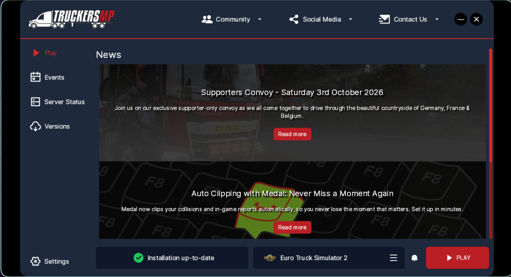
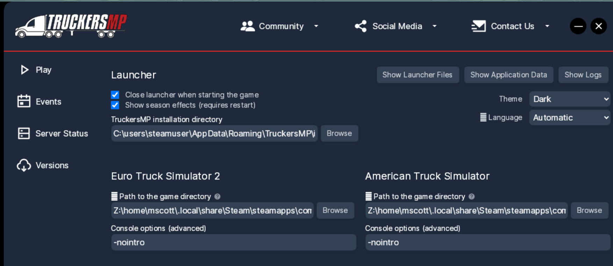
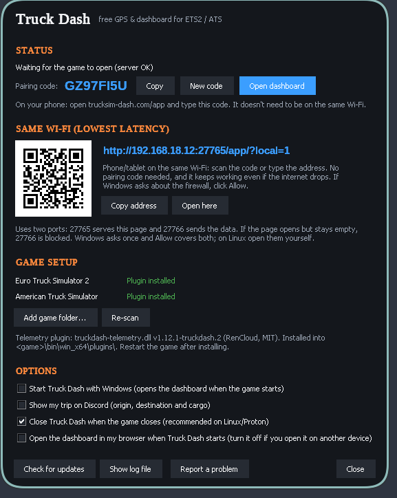
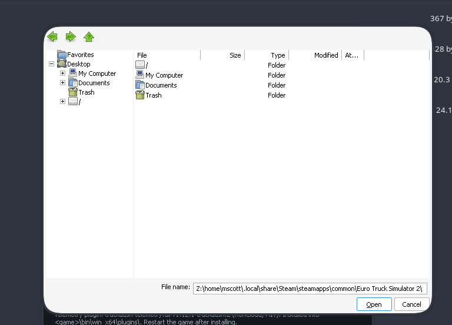

# TruckDash Launchers for Linux

This guide explains how to run TruckDash on Linux under Proton for ETS2/ATS and TruckersMP.

The goal is to create launchers that work correctly in Steam with Proton and compatible launch paths for both Euro Truck Simulator 2 and American Truck Simulator.

## Assumptions

- You have a native Steam installation.
- You have installed Proton-GE Latest.
- You are using Linux with a regular home folder (for example, `/home/YOURUSER`).
- `$` in commands means "run this in a terminal".
- `~` means your home directory.

## 1) Install the required tools

Install Wine, ProtonPlus, Winetricks, and 7zip using your package manager.

### Arch Linux

```bash
sudo pacman -S wine winetricks protonplus 7zip
```

## 2) Set up TruckersMP

### Step 1: Create a folder for the Windows prefix

```bash
mkdir -p ~/TruckersMP
```

### Step 2: Install TruckersMP using Wine

Replace `YOURUSER` with your Linux username and adjust the download path if needed.

```bash
WINEPREFIX="/home/YOURUSER/TruckersMP/" wine "/home/YOURUSER/Downloads/TruckersMP-Setup.exe"
```

Let the installer finish. When the TruckersMP launcher opens, close it once it reaches the main menu and close the terminal window as well.


The launcher will be installed in:

```bash
/home/YOURUSER/TruckersMP/drive_c/users/YOURUSER/AppData/Local/TruckersMP/TruckersMP-Launcher.exe
```

### Step 3: Remove the Wine-created shortcuts

```bash
rm -rf ~/.local/share/applications/wine/Programs/TruckersMP
```

### Step 4: Add TruckersMP to Steam twice

In Steam, add TruckersMP as a non-Steam game twice. Use this path for both entries:

```bash
/home/YOURUSER/TruckersMP/drive_c/users/YOURUSER/AppData/Local/TruckersMP/TruckersMP-Launcher.exe
```

Rename them like this:

- `TruckersMP (ATS)`
- `TruckersMP (ETS2)`

For each of those games:

- Right-click the entry
- Select Properties
- Set the compatibility to Proton-GE Latest
- Add the launch options below

#### TruckersMP (ATS)

```bash
STEAM_COMPAT_DATA_PATH="/home/YOURUSER/.local/share/steam/steamapps/compatdata/270880" %command%
```

#### TruckersMP (ETS2)

```bash
STEAM_COMPAT_DATA_PATH="/home/YOURUSER/.local/share/steam/steamapps/compatdata/227300" %command%
```

This makes the TruckersMP launcher run inside the correct ETS2 or ATS Proton prefix so it can read the appropriate save data.

### Step 5: Configure game paths inside TruckersMP

When the TruckersMP launcher opens, set the game paths for both games. Use these exact entries and replace `YOURUSER` with your Linux username:

```text
Z:\home\YOURUSER\.local\share\Steam\steamapps\common\Euro Truck Simulator 2\
Z:\home\YOURUSER\.local\share\Steam\steamapps\common\American Truck Simulator\
```

You can also add `-nointro` to both launch options if you want.


## 3) Set up TruckDash

Go to the official TruckDash release page and download the latest Windows release:

- https://github.com/Nethercap/truck-companion

Extract it in a terminal:

```bash
7z x TruckDash-windows.zip
```

Create a folder for the executable:

```bash
mkdir -p ~/truckdash
```

Move the executable into that folder:

```bash
mv TruckDash.exe ~/truckdash/
```

### Configure ETS2 and ATS game paths in TruckDash

When you first run TruckDash, you need to specify the game paths for Euro Truck Simulator 2 and American Truck Simulator. Open TruckDash and navigate to the settings menu to configure the game paths.



For each game, set the path to the game installation directory:

- **Euro Truck Simulator 2**: `/home/YOURUSER/.local/share/Steam/steamapps/common/Euro Truck Simulator 2/`
- **American Truck Simulator**: `/home/YOURUSER/.local/share/Steam/steamapps/common/American Truck Simulator/`

Replace `YOURUSER` with your Linux username.



Once configured, TruckDash will be able to connect to the correct game instance when you launch it.

## 4) Create desktop entries for TruckDash

Download the desktop entires from the releases of this repo

Make sure to edit the `.desktop` files and replace `YOURUSER` with your Linux username.

Example launcher file for ETS2:

```ini
[Desktop Entry]
Type=Application
Name=Truck Dash (ETS2)
Comment=Truck Dash client for Euro Truck Simulator 2 (start the game first)
Exec=env STEAM_COMPAT_DATA_PATH="/home/YOURUSER/.local/share/Steam/steamapps/compatdata/227300" STEAM_COMPAT_CLIENT_INSTALL_PATH="/home/YOURUSER/.local/share/Steam" "/home/YOURUSER/.local/share/S[...]
Terminal=false
Categories=Game;
StartupNotify=false
```

Example launcher file for ATS:

```ini
[Desktop Entry]
Type=Application
Name=Truck Dash (ATS)
Comment=Truck Dash client for American Truck Simulator (start the game first)
Exec=env STEAM_COMPAT_DATA_PATH="/home/YOURUSER/.local/share/Steam/steamapps/compatdata/270880" STEAM_COMPAT_CLIENT_INSTALL_PATH="/home/YOURUSER/.local/share/Steam" "/home/YOURUSER/.local/share/S[...]
Terminal=false
Categories=Game;
StartupNotify=false
```

### Make the launchers executable and install them

```bash
chmod +x truckdash-*
cp -a truckdash-* /home/YOURUSER/.local/share/applications/
cp -a truckdash-* /home/YOURUSER/Desktop/
```

These commands make the `.desktop` files executable and place copies in both your application menu and your desktop.

## 5) Useful Proton paths

If needed, Proton-GE is usually installed here:

```bash
/home/YOURUSER/.local/share/Steam/compatibilitytools.d/Proton-GE Latest/proton
```

Regular Proton or Proton Experimental usually lives here:

```bash
/home/YOURUSER/.local/share/steam/steamapps/common/Proton - Experimental/proton
```

## 6) Recommended order of operations

### Singleplayer

1. Start ETS2 or ATS
2. Run TruckDash (ETS2) or TruckDash (ATS)

### TruckersMP

1. Start TruckersMP (ETS2) or TruckersMP (ATS)
2. Start ETS2 or ATS inside that launcher
3. Run TruckDash (ETS2) or TruckDash (ATS)

## Notes

- Use the correct Steam compatibility data path for the game you are launching.
- Ensure the path to `TruckDash.exe` and Proton matches your system.
- Some setups may require adjusting the username path or Proton install location.
